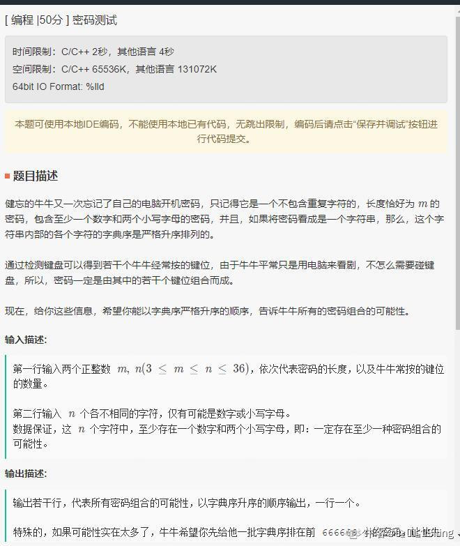
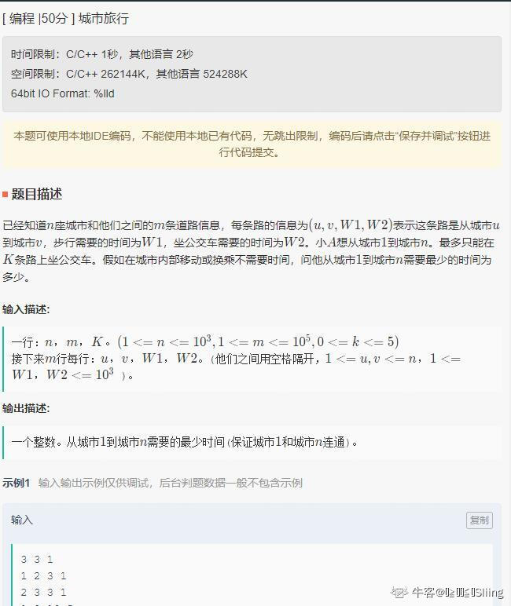

# 1. 序列和
```
题目描述
给出一个正整数N和长度L，找出一段长度大于等于L的连续非负整数，他们的和恰好为N。答案可能有多个，我我们需要找出长度最小的那个。
例如 N = 18 L = 2：
5 + 6 + 7 = 18
3 + 4 + 5 + 6 = 18
都是满足要求的，但是我们输出更短的 5 6 7
```
```
package ali;
import java.util.Scanner;
public class Sequence {
    public static int display(int N,int L){
        for(int i=L;i<101;i++) {
            if((2*N-i*(i-1))%(2*i)==0&&(2*N-i*(i-1))/(2*i)>=0) {
                int a1=(2*N-i*(i-1))/(2*i);
                for(int j=0;j<i-1;j++) {
                    System.out.print(a1+j+" ");
                }
                System.out.print(a1+(i-1));
                return 0;
            }
        }
        System.out.print("No");
        return 0;
    }
    public static void main(String[] args) {
        Scanner in = new Scanner(System.in);
        // 注意 hasNext 和 hasNextLine 的区别
        int N = in.nextInt();
        int L = in.nextInt();
        display(N,L);
    }
}

```
# 3.29笔试
## 1. vote
链接：https://www.nowcoder.com/discuss/627169?type=all&order=time&pos=&page=1&channel=-1&source_id=search_all_nctrack

```
https://www.nowcoder.com/discuss/627252?channel=-1&source_id=discuss_terminal_discuss_history_nctrack&ncTraceId=404983f074a74e1d9a71a1c445802c38.113.16176815608745704
作者：兰坤

小明和我参加班长的选举投票，投票人数为n，每人可以投K票，第一行输入为投票人数，第二行输入为每个人投给小明的票数求保证我能获胜最小的K。
例如下面的示例，由于小明获得1+1+1+5+1=9票，则我获得4+4+4+0+4=12票，我获胜，此时5最小。
输入：
5
1 1 1 5 1
输出：
5

输入：
5
2 2 2 3 4
输出：
6
```
```java
import java.util.Scanner;

public class Vote {
    public static int getK(int maxK, int[] other){
        int sumMe = 0;
        for(int i = 0;i< other.length;i++){
            sumMe += maxK - other[i];
        }
        return sumMe;
    }
    public static void main(String[] args) {
        Scanner in = new Scanner(System.in);
        int n = in.nextInt();
        if(n < 1) return;
        int[] other = new int[n];
        int maxK = 0,sumOther = 0;
        for(int i = 0;i < n;i++){
            other[i] = in.nextInt();
            sumOther += other[i];
            maxK = Math.max(maxK,other[i]);
        }
        int sumMe = getK(maxK, other);
        for(int i = maxK;;i++){
            if(sumMe > sumOther){
                System.out.println(i);
                break;
            }else{
                sumMe += n;
            }
        }
    }
}
```

## 2. 最少的车站

leetcode原题：1334. 阈值距离内邻居最少的城市 floyd算法。
```
作者：兰坤
链接：https://www.nowcoder.com/discuss/627252?channel=-1&source_id=discuss_terminal_discuss_history_nctrack&ncTraceId=404983f074a74e1d9a71a1c445802c38.113.16176815608745704
来源：牛客网

要求n各城市中有m条道路，求在距离d以内，从一个城市到其它城市的数量最少，如遇到数量相同，则选择输出编号最大的那个城市。
第一行，测试数据的组数：t组
第二行：n（城市数量） m（道路条数） d（要求距离）
接下来m行：l（城市编号） r（城市编号） w（距离）
例如：
输入：
1
4 4 4
0 1 3
1 2 1
2 3 1
1 3 4
输出：
3
```

```java
import java.util.Scanner;

public class FindCity {
    public static int findTheCity(int n, int[][] edges, int distanceThreshold) {
        int[][] matrix = new int[n][n];
        //初始化为max
        for(int i = 0; i<n; i++){
            for(int j = 0; j< n; j++){
                if(i == j) matrix[i][j] = 0;
                else{
                    matrix[i][j] = Integer.MAX_VALUE;
                }
            }
        }
        //将edge赋值给matrix
        for(int i = 0; i < edges.length; i++){
            matrix[edges[i][0]][edges[i][1]] = edges[i][2];
            matrix[edges[i][1]][edges[i][0]] = edges[i][2];
        }

        // floyd三层循环
        for(int k = 0;k<n;k++){
            for(int i = 0; i<n; i++){
                for(int j = 0; j < n; j++){
                    //防止溢出
                    if(i == j || matrix[i][k] == Integer.MAX_VALUE || matrix[k][j] == Integer.MAX_VALUE) continue;
                    matrix[i][j] = Math.min(matrix[i][j], matrix[i][k]+matrix[k][j]);
                }
            }
        }
//        for(int i = 0; i<n; i++){
//            for(int j = 0; j < n; j++){
//                //防止溢出
//                if(i != j && matrix[i][j] != Integer.MAX_VALUE)
//                    System.out.println("i:"+i+" j:"+j+" max:"+matrix[i][j]);
//            }
//        }
        //求小于距离阈值的，城市最少的那个
        int ret = 0,minCnt = Integer.MAX_VALUE;
        for(int i = 0; i< n;i++){
            int cnt = 0;
            for(int j = 0;j<n;j++){
                if(i != j && matrix[i][j] <= distanceThreshold) cnt++;
            }
            if(cnt <= minCnt){
                minCnt = cnt;
                ret = i;
            }
            //System.out.println("i:"+i+" cnt:"+cnt);
        }
        return ret;
    }
    public static void main(String[] args) {
        Scanner in = new Scanner(System.in);
        int T = Integer.parseInt(in.nextLine()); //组数
        while(T-- > 0){
            String line = in.nextLine();
            String[] arr = line.split("\\s+");
            //n（城市数量） m（道路条数） d（要求距离）
            int n = Integer.parseInt(arr[0]);
            int m = Integer.parseInt(arr[1]);
            int d = Integer.parseInt(arr[2]);
            int[][] edges = new int[n][3];
            //构造edge矩阵
            for(int i = 0;i<m;i++){
                line = in.nextLine();
                arr = line.split("\\s+");
                edges[i][0] = Integer.parseInt(arr[0]);
                edges[i][1] = Integer.parseInt(arr[1]);
                edges[i][2] = Integer.parseInt(arr[2]);
            }
            int ret = findTheCity(n, edges, d);
            System.out.println(ret);
        }
    }
}
```
# 3.31笔试
链接：https://www.nowcoder.com/discuss/628596?channel=-1&source_id=profile_follow_post_nctrack
## 1. 密码测试
5 8
123abcde


```
package ali;

import java.util.ArrayList;
import java.util.Arrays;
import java.util.Scanner;

public class PassTest {
    static int maxLen = 666666;
    static ArrayList<String> ret = new ArrayList<String>();
    static StringBuffer sb = new StringBuffer();
    public static void dfs(char[] ch, int start, int digitLen, int charLen, int requireLen){
        if(ret.size() > maxLen || sb.length() > requireLen) return;
        if(sb.length() == requireLen){
            if(digitLen >= 1 && charLen >=2) ret.add(sb.toString());
            return;
        }
        for(int i = start; i < ch.length;i++){
            //相等的重复字符跳过
            if(i > start && ch[i] == ch[i-1]) continue;
            sb.append(ch[i]);
            //System.out.println("i:"+i+" sb:"+sb.toString());
            //digit
            if(ch[i] >= '0' && ch[i] <='9'){
                dfs(ch, i+1, digitLen+1, charLen, requireLen);
            }else{
                //alpha
                dfs(ch, i+1, digitLen, charLen+1, requireLen);
            }
            sb.deleteCharAt(sb.length()-1);
        }
    }
    public static void main(String[] args) {
        Scanner in = new Scanner(System.in);
        String line = in.nextLine();
        String[] arr = line.split("\\s+");
        int m = Integer.parseInt(arr[0]); //密码长度
        int n = Integer.parseInt(arr[1]); //长按键位数
        //长按的字符
        String line2 = in.nextLine();
        char[] ch = line2.toCharArray();
        Arrays.sort(ch);
        StringBuffer sb = new StringBuffer();
        dfs(ch, 0,0 ,0, m);
        //遍历
        for(String ret:ret){
            System.out.println(ret);
        }
    }
}

```
## 2. 城市旅行

https://www.nowcoder.com/discuss/628596?type=all&order=time&pos=&page=1&channel=-1&source_id=search_all_nctrack
```

```

# 315
## 1.翻转数字
作者：Soarkey
链接：https://www.nowcoder.com/discuss/614659
来源：牛客网

给你三个数a,b,c，可以对a或b进行多次翻转，[一次翻转的意思是取一位二进制进行翻转（比如0->1，或者1->0）]，现在问你最少需要多少次翻转可以使得翻转后的a|b=c。

这道题在leetcode上有，见 https://leetcode-cn.com/problems/minimum-flips-to-make-a-or-b-equal-to-c/

这里给一下我的代码吧~
```
package ali;

import java.util.Scanner;

/**
 * 给你三个数a,b,c，可以对a或b进行多次翻转，[一次翻转的意思是取一位二进制进行翻转（比如0->1，或者1->0）]，现在问你最少需要多少次翻转可以使得翻转后的a|b=c。
 */
public class minFlips {
    public static int minFlips(int a, int b, int c) {
        int ans = 0;
        for(int i = 0;i<31;i++){
            int bita = (a>>i) & 1;
            int bitb = (b>>i) & 1;
            int bitc = (c>>i) & 1;
            if(bitc == 0){
                ans += bita + bitb;
            }else{
                ans += (bita + bitb == 0)?1:0;
            }
        }
        return ans;
    }
    public static void main(String[] args) {
        Scanner in = new Scanner(System.in);
        int T = Integer.parseInt(in.nextLine()); //组数
        while(T-- > 0){
            String line = in.nextLine();
            String[] arr = line.split("\\s+");
            //n（城市数量） m（道路条数） d（要求距离）
            int a = Integer.parseInt(arr[0]);
            int b = Integer.parseInt(arr[1]);
            int c = Integer.parseInt(arr[2]);
            int ret = minFlips(a, b, c);
            System.out.println(ret);
        }
    }
}
```
## 2. 蜡烛
作者：Soarkey
链接：https://www.nowcoder.com/discuss/614659
来源：牛客网

现在有一根蜡烛长 n 厘米，从一端点火，然后对n-1个位置进行随机切割，将蜡烛分为两段，x和n-x，待较短的一段燃尽后（这里假设x段比较短，较短的一段燃尽后，两段蜡烛长度就变成了 0 和 n-x-x 了， 注意这里两段蜡烛是同时在燃烧！！），再对剩余的蜡烛（即n-x-x段）进行下一轮切割。 【注意只能切割两次，这里我看漏题了！qswl！】
一种 切割方案会产生一个蜡烛燃烧的时间t，现在要求得所有切割方案下蜡烛燃烧时间的期望值。

画了个粗略的草图，如下：

这道题我只想出了dfs的方法，但是超时了，贴在下面供大家参考， 如果有同学有更棒的idea，欢迎评论区讨论，大家一起学习！

作者：牛客60048244号
链接：https://www.nowcoder.com/discuss/614729?type=all&order=time&pos=&page=1&channel=-1&source_id=search_all_nctrack
来源：牛客网

切割蜡烛；

总共最多切割两次

蜡烛长度为n 厘米，每分钟燃烧1厘米

最多切割n-1厘米，最少1cm

切割任意长度的概率均为 1 / （n-1）

切割完以后，两根蜡烛同时燃烧。

如果蜡烛最后剩下的长度>=2。需要重新像上边一样重新随机切割一次。这次切割以后，不再切割了。并且切割完以后，两根蜡烛同时燃烧。

求总共的蜡烛燃烧的数学期望时间(单位：分钟)

输出浮点数，保留4位精度

输入数据：

就一行，输入长度n，n最大不超过10的4次方

输入示例：

1
4
输出:

1
2.0000
```java
public class CandleFire {
    public static double candleFire(int n) {
        double[] fMin = new double[n];//第一次燃烧时间
        int[] diffSize = new int[n]; //差值
        double[] sMin = new double[n];//二次总的燃烧时间
        for(int i = 1;i<=n-1;i++){
            fMin[i] = Math.min(i, n-i);
            diffSize[i] = Math.abs(2*i-n);
        }
        //二次总的燃烧时间
        for(int i = 1;i<n;i++){
            if(diffSize[i] == 2 || diffSize[i] == 1){
                sMin[i] = fMin[i] + 1;
            }else if(diffSize[i] == 0){
                sMin[i] = fMin[i];
            }else{
                double sum = 0d;
                //其他情况
                for(int j = 1;j< diffSize[i]; j++){
                    sum += Math.max(j, diffSize[i] - j)/(diffSize[i] - 1.0);
                }
                sMin[i] = fMin[i] + sum;
            }
        }
        double ret = 0d;
        for(int i = 1;i < n;i++){
            ret += sMin[i]/(n-1.0000);
        }
        return ret;
    }
    public static void main(String[] args) {
        Scanner in = new Scanner(System.in);
        int n = Integer.parseInt(in.nextLine()); //组数
        double e = candleFire(n);
        //保留4位小数
        System.out.println(String.format("%.4f",e));
    }
}
```