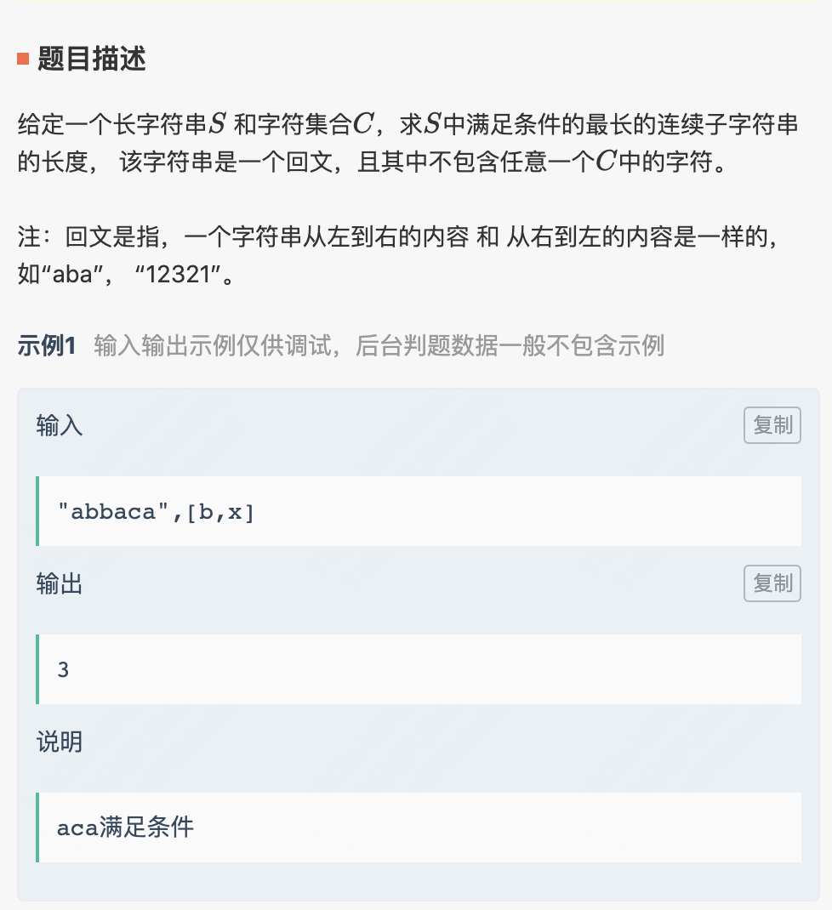
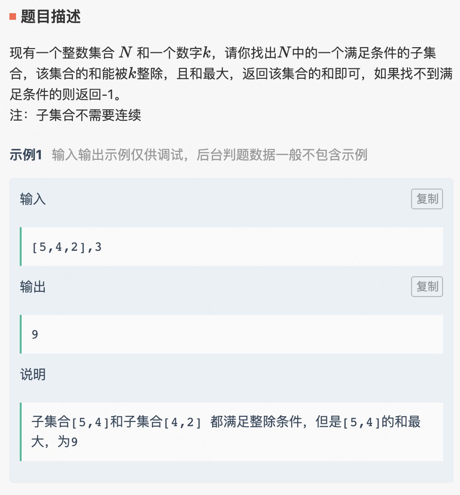
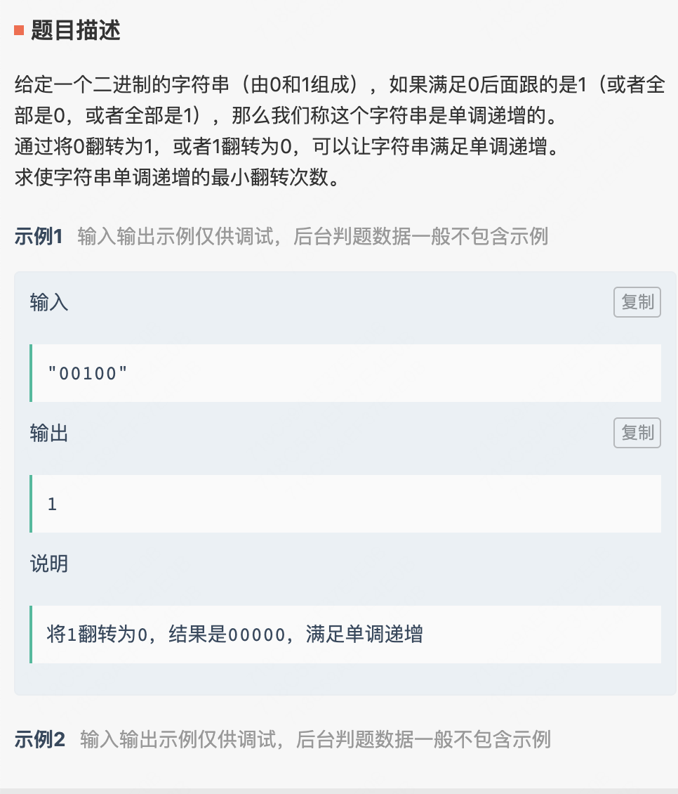
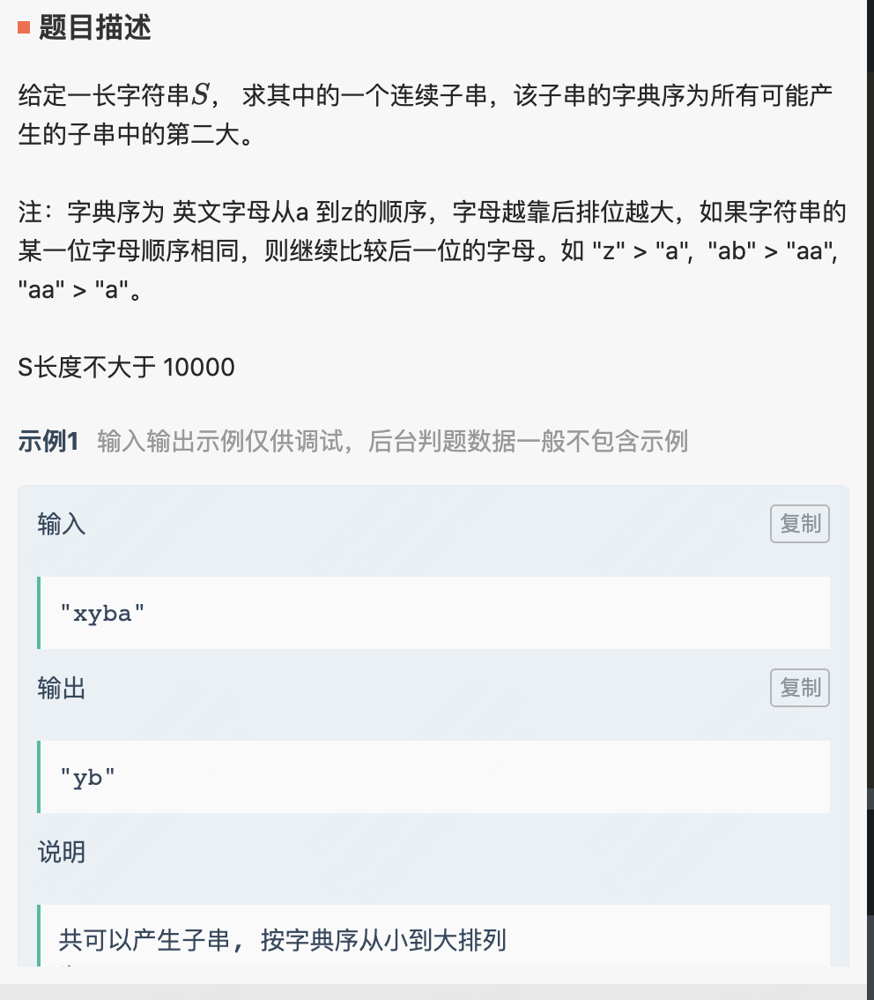

# 20210508 笔试
## .1最长回文
ac
leetcode 5

```java
import java.util.HashSet;
import java.util.Scanner;

//煎饼
public class Main1 {
    static HashSet<Character> set = new HashSet<Character>();
    public static int specialStr(String inputStr, char[] cList) {
        // write code here
        if(inputStr == null || inputStr.length() <1) return 0;
        for(int i = 0;i< cList.length;i++){
            set.add(cList[i]);
        }
        int len=0;
        for(int i= 0;i<inputStr.length();i++){
            int len1 = expand(inputStr, i, i);
            int len2 = expand(inputStr, i, i+1);
            int curLen = Math.max(len1,len2);
            System.out.println("i:"+i+" curlen:"+curLen+" len1:"+len1+" len2:"+len2);
            len = Math.max(len,curLen);
        }
        return len;
    }
    public static int expand(String s,int left,int right){
        while(left >=0&&right<s.length()&&s.charAt(left)==s.charAt(right)&&!set.contains(s.charAt(left))&&!set.contains(s.charAt(right))){
            --left;
            ++right;
        }
        return right - left-1;
    }
    public static void main(String[] args) {
        String a = "abbaca";
        char[] b = {'b','x'};
        int ret = specialStr(a, b);
        System.out.println(ret);
    }
}
```

## 2.能被k整除的最大子序列

10% 超时
```
import java.util.HashMap;
import java.util.HashSet;
import java.util.Map;

//煎饼
public class Main2 {
    public static int bestSubCollection(int[] nums, int k) {
        // write code here
       HashMap<Integer,Integer> record = new HashMap<>();
       record.put(0,1);
       int sum = 0;
       for(int elem:nums){
           sum+=elem;
           int modulus = (sum%k+k)%k;
           record.put(modulus,record.getOrDefault(modulus,0)+1);
       }
       int ans = 0;
       for(Map.Entry<Integer,Integer> entry:record.entrySet()){
           ans +=entry.getValue()*(entry.getValue()-1)/2;
       }
        return ans;
    }
    public static int bestSubCollection2(int[] nums, int k) {
        // write code here
        int sum = 0;
        for(int i = 0;i<nums.length;i++){
            sum +=nums[i];
        }
        if(sum%k == 0) return sum;
        int ret = dfs(sum,nums,0,k);
        return ret;
    }
    static HashSet<Integer> set = new HashSet<>();
    static int dfs(int sum,int[] nums,int i,int k){
        if(set.contains(sum)) return -1;
        set.add(sum);
        if(sum%k==0) return sum;
        if(i>nums.length-1) return -1;
        int len1 = dfs(sum-nums[i],nums,i+1,k);
        int len2 = dfs(sum,nums,i+1,k);
        return Math.max(len1,len2);
    }
    public static void main(String[] args) {
        int[] a = {5,4,2};
        int b = 3;
        int ret = bestSubCollection(a, b);
        System.out.println(ret);
    }
}
```
## 3. 单调递增最小反转次数

leetcode 926
ac
```java
public class Main3 {
    public static int filpString(String s) {
        // write code here
        int n = s.length();
        int[] arr = new int[n+1];
        for(int i = 0;i<n;i++){
            arr[i+1] = arr[i] +(s.charAt(i)=='1'?1:0);
        }
        int ret = Integer.MAX_VALUE;
        for(int i = 0;i<=n;i++){
            ret = Math.min(ret, arr[i]+n-i-(arr[n]-arr[i]));
        }
        return ret;
    }
    public static void main(String[] args) {
        String str = "00100";
        int ret = filpString(str);
        System.out.println(ret);
    }
}
```
## 4. 字典序第二大的子序
leetcode 1163

ac
```java
public class Main4 {
    public static String getTop2Str(String rawStr) {
        // write code here
        char[] str = rawStr.toCharArray();
        int index = str.length-1;
        int secIndex = -1;
        int max = 0;
        for(int i = str.length-1;i>=0;i--){
            if(str[i]-'a'>max){
                secIndex = index;
                index = i;
                max = str[i] -'a';
            }else if(str[i]-'a' == max){
                if(i-1>=0&&str[i]==str[i-1]) continue;
                int temp = index;
                secIndex = index;
                index = i;
                max = str[i]-'a';
                for(int j = i,k=temp;j<str.length&&k<str.length;j++,k++){
                    if(str[k]-'a'==str[j]-'a') continue;
                    if(str[k]-'a'>str[j]-'a'){
                        index = temp;
                        max = str[index]-'a';
                        break;
                    }else if(str[k] - 'a' < str[j]-'a'){
                        break;
                    }
                }
            }
        }
        return rawStr.substring(index,rawStr.length()-1);
    }
    public static void main(String[] args) {
        String str = "xyba";
        String ret = getTop2Str(str);
        System.out.println(ret);
    }
}

```